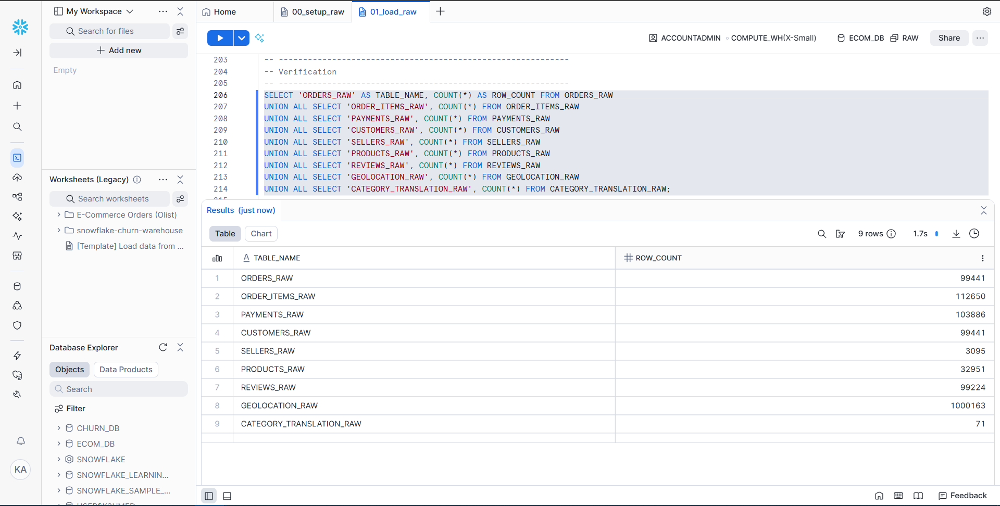
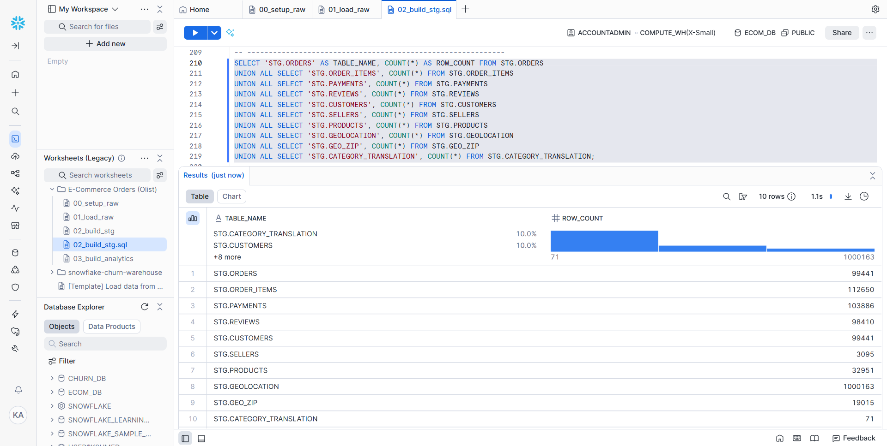
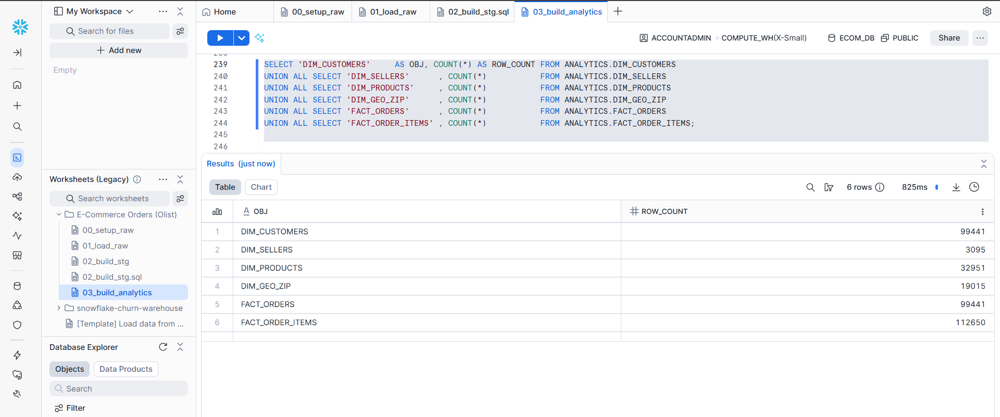
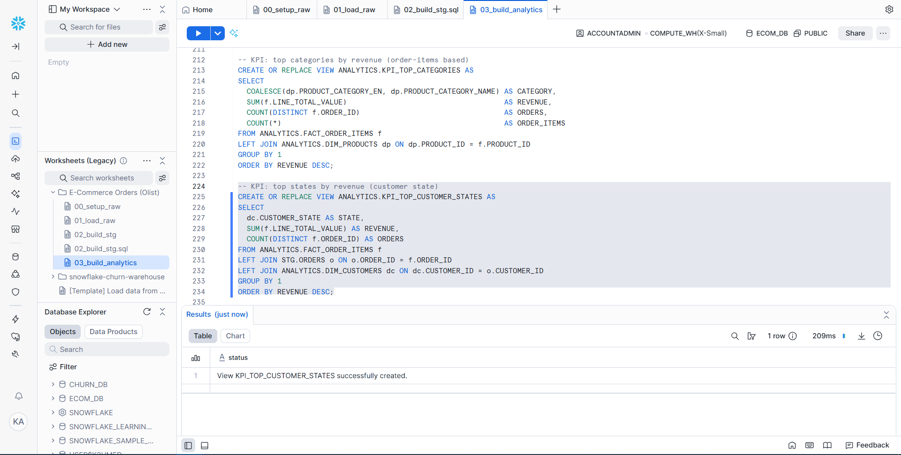
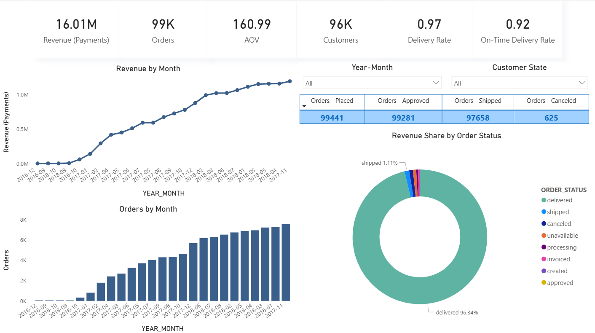
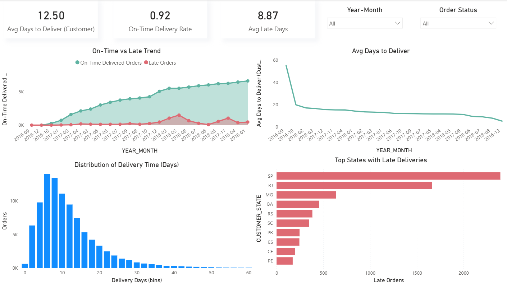
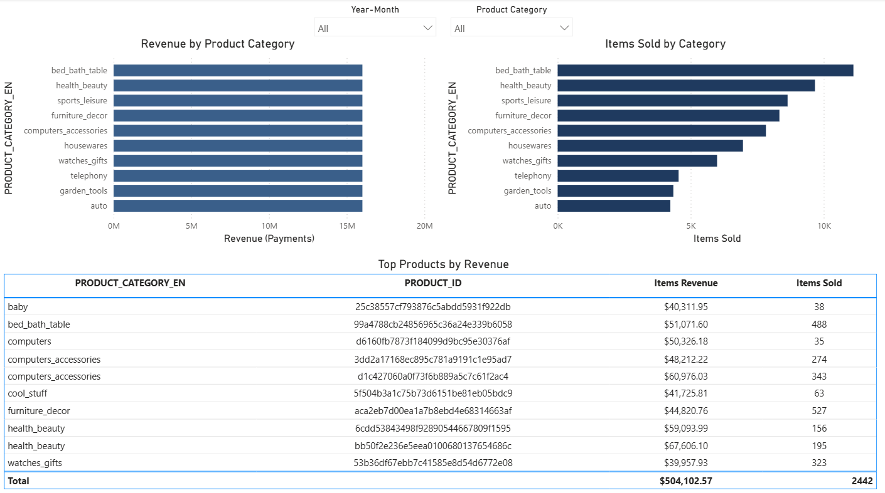
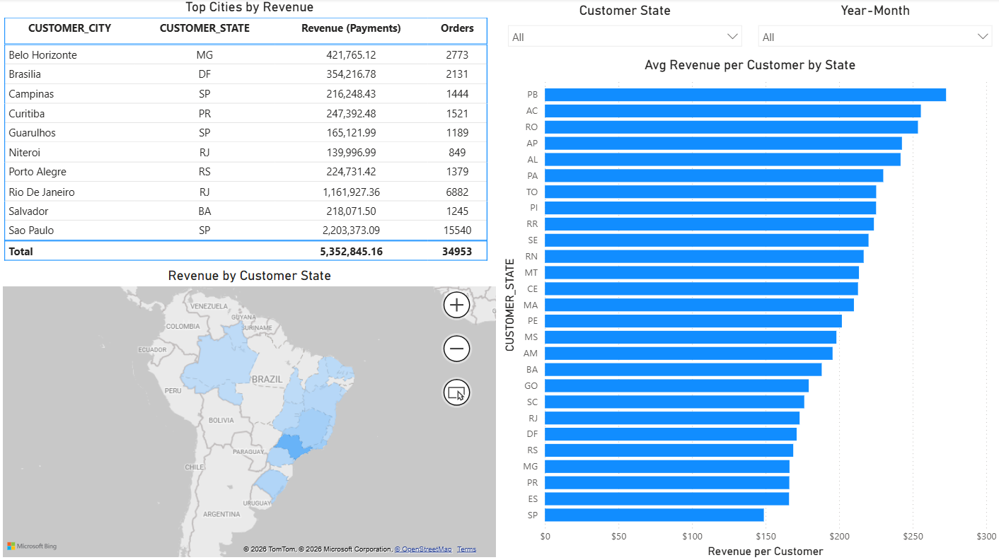

# E-Commerce Analytics Platform  
**Snowflake → Power BI | End-to-End Analytics Engineering & BI Project**

---

## Overview

This project is a **production-style analytics platform** built end-to-end using **Snowflake as the analytical warehouse** and **Power BI as the consumption layer**.

The goal was not just to build dashboards, but to design a **real analytics pipeline**:
- Raw ingestion
- Typed and cleaned staging models
- Star-schema analytics marts
- KPI-driven BI reporting
- Portfolio-grade documentation and validation

Every layer was intentionally designed to mirror how **modern analytics teams** operate in industry.

---

## Tech Stack

**Data Warehouse**
- Snowflake (RAW → STG → ANALYTICS architecture)

**BI & Visualization**
- Power BI
- Advanced DAX (time intelligence, KPIs, ratios, MoM metrics)

**Workflow & Engineering Practices**
- Jira (task tracking, breakdown by ingestion / modeling / BI)
- AWS (dataset hosting & cloud familiarity)
- SQL-first transformations
- BI-friendly semantic modeling

---

## Architecture

```

CSV Files (Cloud Storage)
↓
Snowflake RAW (Ingestion Layer)
↓
Snowflake STG (Typed + Cleaned Models)
↓
Snowflake ANALYTICS (Star Schema + KPI Views)
↓
Power BI (Semantic Model + Dashboards)

````

This separation ensures:
- Reproducibility
- Debuggability
- BI performance
- Clear ownership of logic

---

## Snowflake Implementation (Core of the Project)

### 1. RAW Layer — Controlled Ingestion

- Loaded multiple CSV datasets into Snowflake using internal stages
- Explicit file formats (CSV handling, null logic, trimming)
- No transformations at this layer
- Full row-count validation after ingestion

**Purpose:** Preserve source data exactly as delivered.

📸 *Screenshot Placeholder — RAW Load Validation*
```markdown

````

---

### 2. STG Layer — Typed, Cleaned, Deduplicated

This is where **real analytics engineering** begins.

Key work done:

* Explicit data typing (dates, timestamps, numerics)
* Business-safe filtering (invalid or incomplete rows)
* Deduplication using window functions and `ROW_NUMBER()`
* Consistent naming conventions
* Timestamp normalization for BI

This layer guarantees that **Power BI never performs data cleaning**.

📸 *Screenshot Placeholder — STG Transformations*

```markdown

```

---

### 3. ANALYTICS Layer — Star Schema Design

Designed a **Power BI-optimized star schema**:

**Facts**

* `FACT_ORDERS`
* `FACT_ORDER_ITEMS`

**Dimensions**

* `DIM_CUSTOMERS`
* `DIM_PRODUCTS`
* `DIM_SELLERS`
* `DIM_GEO_ZIP`
* `DIM_DATE`

**KPI Views**

* Delivery performance KPIs
* Order funnel metrics
* Category performance summaries

All relationships are:

* One-to-many
* Directional (dimension → fact)
* BI-friendly and scalable

📸 *Screenshot Placeholder — Analytics Schema*

```markdown

```

---

### 4. Data Quality & Validation

Before connecting Power BI:

* Row counts validated across RAW, STG, and FACT layers
* Fact-to-dimension alignment verified
* Orders, customers, and items cross-checked for consistency

This ensured **trustworthy KPIs** downstream.

📸 *Screenshot Placeholder — KPI Validation*

```markdown

```

---

## Power BI Semantic Model

Power BI was used **only for analysis and visualization**, not data cleanup.

### Modeling Principles

* Star schema imported directly from Snowflake
* Hidden technical columns
* Clean field naming for business users
* Relationships driven by Snowflake design (not auto-guessed logic)

---

## DAX & Metrics (Advanced)

Built a robust DAX layer including:

* Revenue (Payments)
* Orders by lifecycle stage
* AOV
* MoM growth metrics
* Delivery rate
* On-time delivery rate
* Avg delivery days
* Avg late days
* Revenue per customer
* Items GMV

All KPIs were:

* Time-aware
* Filter-safe
* Reusable across pages

---

## Dashboard Pages & Business Insights

### Page 1 — Executive Overview

**What it answers**

* How is the business performing overall?
* Are revenue and orders trending up or down?
* Where are orders being lost?

**Key insights**

* Revenue closely follows order volume trends
* Cancellations represent a very small share of total orders
* Seasonal fluctuations are clearly visible

📸 *Screenshot Placeholder*

```markdown

```

---

### Page 2 — Delivery Performance

**What it answers**

* Are deliveries meeting expectations?
* How severe are late deliveries?
* Which regions struggle the most?

**Key insights**

* Majority of orders are delivered on time
* Late deliveries have a long-tail distribution
* Certain states consistently show higher late delivery counts

📸 *Screenshot Placeholder*

```markdown

```

---

### Page 3 — Product & Category Performance

**What it answers**

* Which categories drive revenue?
* Are top-selling items also top-revenue items?
* Where does volume vs value diverge?

**Key insights**

* Some categories sell many items but generate lower GMV
* Revenue concentration exists across a small subset of categories
* Product-level revenue dispersion is significant

📸 *Screenshot Placeholder*

```markdown

```

---

### Page 4 — Customer Geography

**What it answers**

* Where are customers generating the most revenue?
* Which states have the highest revenue per customer?
* How does geographic demand vary?

**Key insights**

* Revenue concentration in a small number of states
* Some states generate fewer orders but higher revenue per customer
* Geographic segmentation reveals expansion opportunities

📸 *Screenshot Placeholder*

```markdown

```

---

## Jira & Workflow Management

This project was executed using **Jira**, broken down into:

* Ingestion tasks
* STG modeling tasks
* Analytics schema design
* KPI validation
* BI development

This mirrors **real analytics team workflows**, ensuring:

* Traceability
* Iterative delivery
* Clear ownership of logic

---

## Why This Project Matters

This is **not** a dashboard-only project.

It demonstrates:

* Analytics engineering fundamentals
* Snowflake data modeling expertise
* BI semantic modeling discipline
* Advanced DAX competency
* End-to-end ownership from raw data to executive insights

It reflects how analytics work is actually done in:

* Fintech
* E-commerce
* Data-driven organizations

---

## What I’d Extend Next

* Incremental loads using Snowflake tasks
* dbt integration for versioned models
* Row-level security in Power BI
* Forecasting and SLA monitoring
* Automated data quality checks

---

## Author

**Khushnud Ahmed** <br>
Applied Data Science & Analytics <br>
Snowflake • SQL • Power BI • DAX • Analytics Engineering
